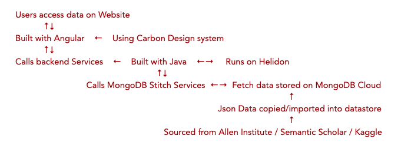
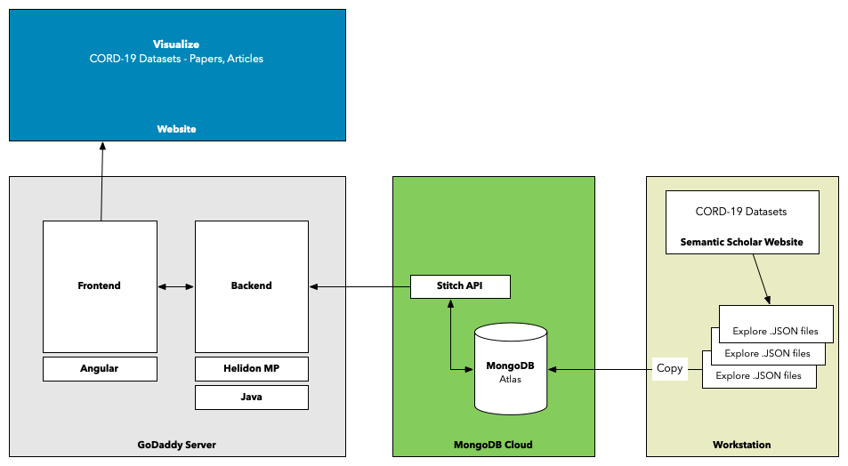
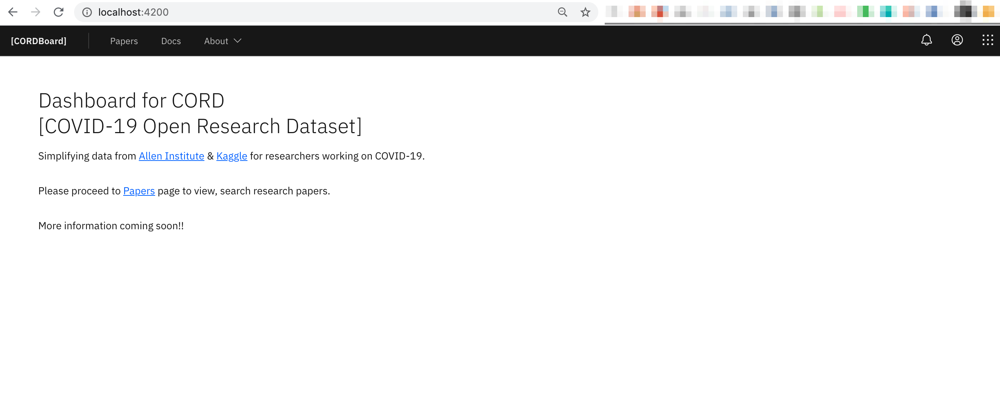
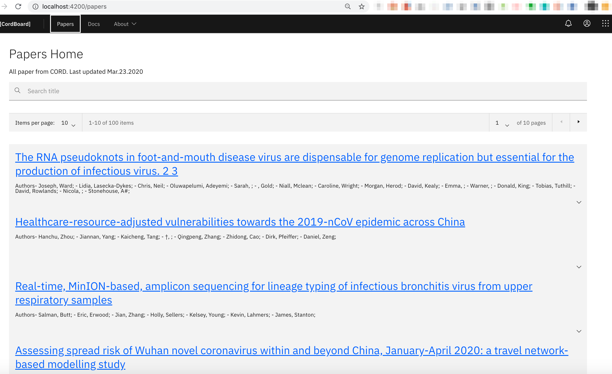
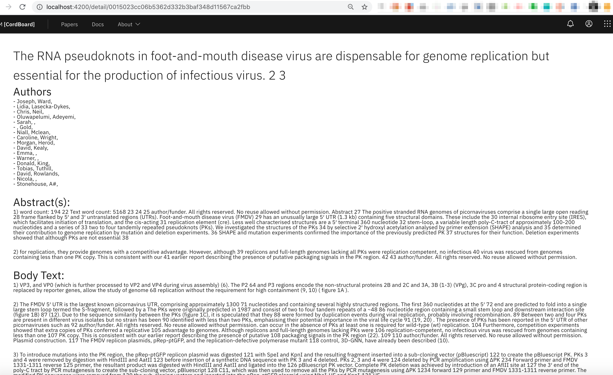
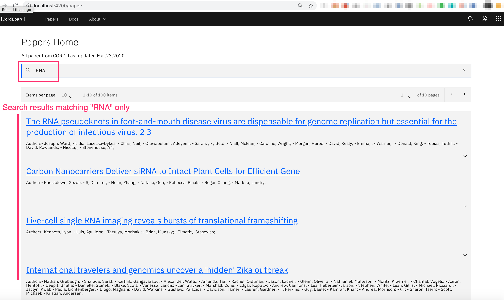

A Dashboard for COVID-19 Open Research Dataset (CORD-19). Enabling researchers to search, view Coronavirus based research papers in a simlpe way.

# Introduction
As we all now Coronavirus has become a major health concern for people across the globe. Almost every country is affected by it. While Governments with help from medical professionals are working 24 x 7 to take care of people and to find a cure for this virus. Lots of research is also being done around the world. This research, however big or small, can help researchers, companies, medical professionals to reduce the effects of the virus with persons affected, help in educating Governments and public on how to help reduce the spread of the virus, finding a cure or a vaccine and many such uses.

Several for-profit and non-profit organizations are coming forward to help mitigate the pandemic in whatever ways they can. One such effort is from the Semantic Scholar team at the Allen Institute for AI, partnering with some research groups to provide CORD-19 (COVID-19 Open Research Dataset) which is a free resource of more than 57,000 scholarly articles about the novel coronavirus for use by the global research community.

# Motivation
This project, CORDBoard, was started with such motivation to help the global research community. Allen Institute makes these datasets available, but the raw formats (json documents) are not usable without a proper User Interface. Also these json documents are plain text files and do not need to conform to a specific structure. These are easy to gather and store data, while special interfaces need to be developed programmatically to make these readable, searchable. 

The “Call to Action” for technical help and community contributions from Kaggle was another motivation to start this project. 

CORDBoard is such an experiment that takes in the raw datasets and presents the users with an elegant, simple to use interface.

# The Problem
The CORD datasets released by Allen Institute and other partners, are rich in information  nested into complex json structures. These datasets cannot be used as they are, and needed a user interface for users to view, read and search through them.

Usually, research papers have two primary properties:
Information on the topic of research, and
References to other articles, papers, blogs, books 

Before getting into the details of the problems, let us review what the datasets are.

## Dataset Description
In response to the COVID-19 pandemic, the White House and a coalition of leading research groups have prepared the COVID-19 Open Research Dataset (CORD-19). CORD-19 is a resource of over 57,000 scholarly articles, including over 45,000 with full text, about COVID-19, SARS-CoV-2, and related coronaviruses. This freely available dataset is provided to the global research community to apply recent advances in natural language processing and other AI techniques to generate new insights in support of the ongoing fight against this infectious disease. There is a growing urgency for these approaches because of the rapid acceleration in new coronavirus literature, making it difficult for the medical research community to keep up - Source: Kaggle (https://www.kaggle.com/allen-institute-for-ai/CORD-19-research-challenge)

# Key Issues
Some of the main issues identified are:

1. Complex data
2. Presentation of data
3. Search
4. Performance

Below are detailed explanations of the issues.
## 1. Complex data
The datasets released by Allen Institute have primarily datasets which are collections of research papers from three key sources:
1. CZI
2. PMC
3. BioRxiv/MedRxiv

Since each research paper contains lots of information on the topic and references the Authors used, the overall data structure becomes complex with multi-levels and nesting.

For example, Each Paper has:
- 1 Title
  - Metadata
    - Several Authors
      - With their details like Names, Contact info, Work details etc.
- Several abstracts
- Several Citations
- Several References to Books

Manipulating these complex structures to make them presentable is a complex task for programmers. 

## 2. Data is updated regularly
Allen Institute proposed to be updating their dataset periodically, at least once a week. Importing this data into an existing database, overwriting existing and adding new records will be a tedious job. 

## 3. Presentation of data
The primary idea of this project is to make this data viewable and searchable for users. Reading the complex/nested data, parsing them programmatically into programmatic objects and then presenting these in a simple, elegant way for users is a big challenge.

Also, the application needs to focus on end-users. Since this is targeted at a global audience, some of them may have little computer knowledge, and this application needs to have a simple to use interface. 

## 4. Search
The more data points per research paper, the more users would want to search. And this multiplies by the number of papers the whole dataset consists. As of this writing (April, 28, 2020) there are about 47,000 papers. 

In the computing world, 47,000 records is not big/huge, but the primary concern is the circular references each research paper contains. If every search needs to go through all the dataset to g=fetch found papers, it may slow down the application posting requirements for more infrastructure.

## 5. Performance
The intention for Allen Institute to make their dataset used by the global research community. Although a minimum network with basic internet speeds are required for a website to function. Unfortunately not all researchers at different countries/regions may not have access to high-speed internet. Care needs to be taken to make application load data in an acceptable time without crashing or failing often. 

# The Solution
The primary intention for this project was to develop an easy to use, simple, elegant solution for researchers across the globe to view and search the dataset. One of the options I chose was to build a website and to make the usage free for all. 

Why not a mobile app? Although the usage of a mobile has exceeded that of desktop/laptop computers, researchers still prefer using computer desktops/laptops. Some of the reasons A) to be able to view lots of data in a better way on a larger screen that that of smaller mobile screens and B) Research papers have lots of references, opening multiple tabs and moving between them is easier on desktops/laptops. 

The website being built will also be responsive, which automatically adjusts its display based on the users’ screen size.

## Approach

My Approach has been to: Focus on the User Interface and User Experience (UI/UX) while not getting into the details of the structure of raw data in the dataset.

My approach was broken down into five parts, each solving a piece of the puzzle.

**Part 1: Import the raw dataset as-is into a data store**
- Problems addressed:
  - The dataset is frequently updated at the source, so this way the dataset can be downloaded and imported/overwritten on top of the existing data without much effort

**Part 2: Make data available as a service**
- Problems addressed:
  - Provides a layer of abstraction to backend or consumer applications
Can be extensible for other applications
	
**Part 3: Parse the raw/json data into programmable objects at backend**
- Problems addressed:
  - Provides a layer of abstraction to front-end or consumer applications
  - Will be easier for consumption by the front-end
  - Can be extensible to be used by other applications
  - Will help in server side rendering and performing complex operations like Search, Pagination, etc.

**Part 4: Read the data objects from backend and manage user interactions in a performant way**
- Problems addressed:
  - Need not get into the details of the data structure. It has been abstracted at backend level.
  - Using a robust front-end framework that can handle presentation of large dataset and user interactions in a performant way without much boilerplate code and make it easier for developers to program without much effort.

**Part 5: Handle presentation details of the website in a simple way**
- Problems address:
  - Using a mature design system that has pre-built components. This makes development easier with less boilerplate code for designers and development teams.
  - Build applications faster and scale it efficiently.
  - The UI is responsive and site design looks consistent across all platforms. 
 
## Architecture
To address all the problems, and solution approach, the following architecture was developed to build the website.

## Overall Architecture

## Application Security
The dataset is freely available but unauthorized/improper access to data should be not allowed. 

CORDBoard website has been built using modern application development adding abstraction at all layers. 

1. [Abstraction at database level]: Raw/JSON data is stored in MongoDB database. 
   a. This data is exposed as a service using MongoDB’s Stitch Services (needs a secure key to access). 
2. [Abstraction at backend level]: Java code (intended as backend) reads/consumes the database/stitch service. 
   a. This code does not know about where and how the data is stored. 
   b. The data read by Java code is parsed, read into java objects and exposed as a service.
3. [Abstraction at Frontend level]: Angular code (intended as front-end) read/consumes the Java services. 
   a. This code does not know anything about where and how the data is stored and retrieved. 

## Technology Stack
CORDBoard site has been built using the following technologies/frameworks.
- IBM Carbon Design System [version 10.6]
- IBM Carbon Angular Component [version 3.17]
- Angular [version 8.x]
- Java [version JDK 8]
- Helidon MP [version 1.4] - web server to run Java application
- MongoDB Cloud - Atlas and Stitch services

# CORDBoard Website Demo
## Home Page

## Research Papers Home Page

## Paper Detail Page

## Search and Pagination

# What’s Next?
While this is just the beginning, there is so much more to do. And when the entire world’s research community comes together to solve a unique problem common to all of them, it will need teams of professionals from several fields to join hands. This project may be providing a small/miniature solution to a major global pandemic, but as an old saying “A journey of a 1000 miles starts with a single step”, yes we have to start somewhere and not give up.

As the global research community does more work, we can expect to see more (and maybe an exponential growth on the release of) related research. With more data, there will be a need for more sophisticated software applications. 

I am also continuing to work on the site to add more features and make it more performant. 

There is so much more to do.. So much. And as Robert Frost says “Miles to go before I sleep!”.

---

# References
1. Kaggle COVID-19 Open Research Dataset Challenge (CORD-19)  https://www.kaggle.com/allen-institute-for-ai/CORD-19-research-challenge
2. Semantic Scholar CORD-19 https://www.semanticscholar.org/cord19
3. IBM Carbon Design System  https://www.carbondesignsystem.com/
4. Angular Framework  https://angular.io/
5. Java Programming Language https://www.oracle.com/java/
6. Helidon https://helidon.io/#/
7. MongoDB Atlas https://www.mongodb.com/cloud/atlas
8. MongoDB Stitch https://www.mongodb.com/cloud/stitch

---

# About Author
Suren Konathala is a passionate, technology specialist on a mission to simplify technology adoption for organizations. For over two decades he has been (and still is) a developer, architect, consultant, manager and loves to Write and Talk about technology. He holds a Masters degree in Computer Science, studied at Carnegie Mellon and Stanford Universities. He worked in the technology industry at several levels including startups to fortune 100 companies and this experience has helped him learn about technology, projects, technology, people, teams and continues to learn. 

He has a strong inclination towards advocating for a more inclusive and an open-source / community based technology innovation and development. He is a constant learner and helps teaching, coaching, mentoring individuals and businesses.

He can be reached on Twitter at [@surenkonathala](https://twitter.com/surenkonathala) or [LinkedIn](https://www.linkedin.com/in/ksurendra).
